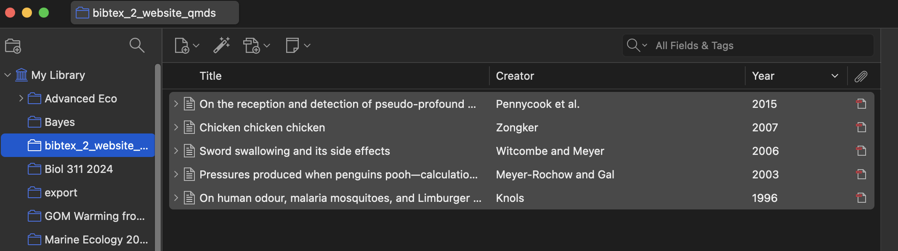
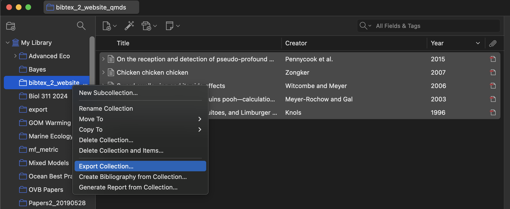
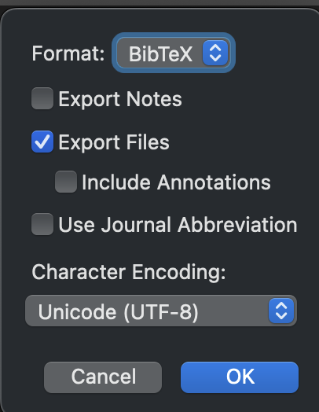

## bibtex_2_website_qmds

The tools in this repo should allow folk building an academic or other website with a full listing of publications/citations an easy way to convert a bibTeX file generated by Zotero or other reference source into a set of pages for a [quarto website listing page].  It will also move pdfs over.

## How to use

This script was developed by exporting a library to bibTeX from [Zotero's](https://www.zotero.org/) desktop app. 

0. Make a quarto website R project. Pull this repo and put the publications directory into your website project. You can remove the folders inside of `articles`. Add a folder for where you will be exporting your publications.  
  
1. Make a library of the entries you want to export. Clean up each entry and make sure it has a pdf where possible.  

  
2. Export that library to bibTeX.   

  
3. When you select export, make sure to export the files as well.  

  
4. Choose the subdirectory you created earlier in the `publications` directory for your export.   

  
5. Open `publications/_scripts/runme.R` in your `publications/` folder. Edit the options so that `bibfile` is the path to your `.bib` output. `pdf_files_folder_location` is the path of the directory that holds another directory inside of it called `files`. `outfold` should be the folder where your folders with qmd, bib, and pdf files will live for your website. You can set `overwrite` to TRUE if this is your first time and it takes a few gos to make everything work right. After that, set it to FALSE so that you don't accidentally overwrite in the future.  
  
6. Run! If it fails, you might have to edit `publications/_scripts/bibtex_2_website_qmds.R' a bit. Feel free to fork this repo and make fixes that you then issue a pull request for. This is definitely a work in progress.    
  
7. Once things are set to your satisfaction, in `publications/_scripts/runme.R` set `overwrite=FALSE` so you don't accidentally overwrite your hard work. I'd also comment out that section so you cannot run it again.  

8. In the future when you add new publications, just export that publication alone as you did for the whole library above. Put in a new set of lines in `publications/_scripts/runme.R` for JUST this export. Run it to generate new quarto listings and update your website! 
